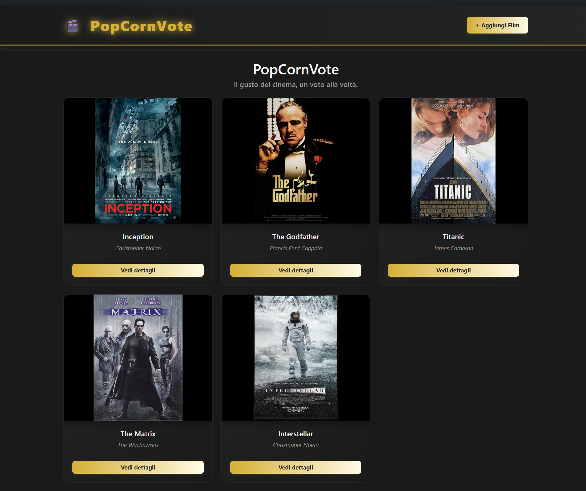
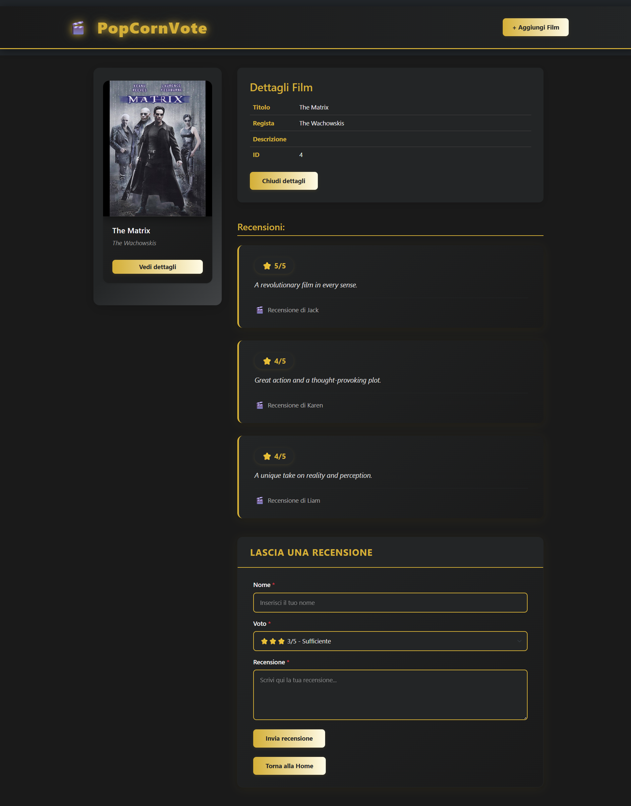
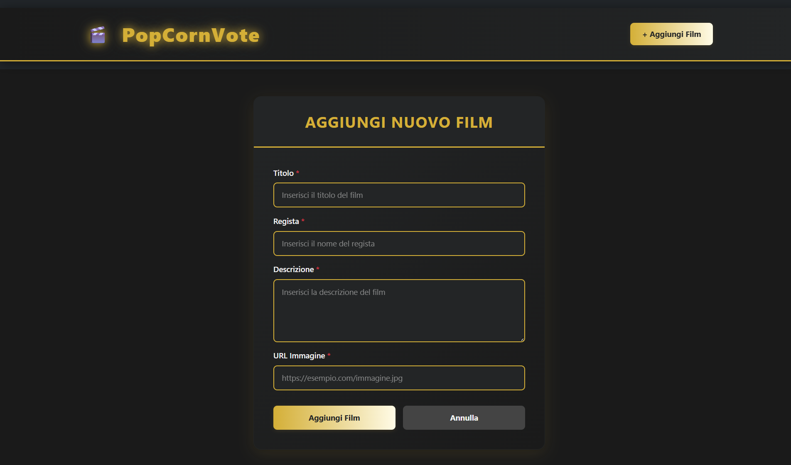

<h1 align="center">Webapp</h1>

###

  
  
  
  
  
  
  
  
  
  
  
  
  

 
 
 
###

 Esercizio Ciao ragazzi, è ora di mettere alla prova le vostre conoscenze iniziando a costruire la vostra prima app completa! Ecco i primi step  Utilizzando il file in allegato, creiamo un database con MySQL Workbench Creiamo una nuova applicazione Express Colleghiamo l’app al db e verifichiamo che tutto funzioni Prepariamo una rotta index per ottenere la lista dei film Prepariamo una rotta show per ottenere i dettagli di un singolo film e le sue recensioni  Bonus Inserire le immagini nel progetto express Inserire i dati di connessione al database come variabili d’ambiente Inserire le vostre API in controller Inserire le vostre rotte in un router Inserire un middleware per le rotte inesistenti Inserire un middleware per la gestione errori  Esercizio Ora è il momento di prepararci al frontend della nostra Web App!  MILESTONE 0   Ragionare e preparare uno schemino per impostare la struttura del lavoro in maniera da sfruttare la riutailizzabilità dei componenti React e le loro props.  MILESTONE 1  Mettiamo su un nuovo progetto React aiutandoci con Vite Ripuliamo come sempre l’app da file e codice di esempio non necessari Installiamo il necessario: React Router, Axios e Bootstrap (se volete utilizzarlo)  MILESTONE 2  Creiamo un layout di base per la nostra applicazione ed impostiamo le rotte per le diverse pagine. Creiamo 2 pagine: La home, in cui mostreremo la lista dei film La pagina di dettaglio di un singolo film  MILESTONE 3  Configuriamo l’app di backend (repo webapp-express) a ricevere chiamate dalla nostra applicazione React, installando e impostando il middleware CORS  Bonus Curare l’aspetto estetico della vostra applicazione.   🧐 Come detto avremo due giorni per completare questa parte, quindi non preoccupatevi se non riuscite a far tutto. Domani aggiungeremo il resto ma sarà in continuazione con questa parte. Il milestone 3 se volete lasciatelo perdere ci servirà poi domani.  Riprendiamo il lavoro fatto ieri e lo continuiamo.  MILESTONE 3  Configuriamo l’app di backend (repo webapp-express) a ricevere chiamate dalla nostra applicazione React, installando e impostando il middleware CORS Proviamo quindi ad effettuare una chiamata Ajax dalla home del progetto React, per ottenere la lista dei libri  MILESTONE 4  In ultimo, effettuiamo una chiamata AJAX dalla pagina di dettaglio per ottenere il dettaglio di un singolo film, comprese le sue recensioni  Bonus Curare l’aspetto estetico della vostra applicazione; se il resto è a dri poco perfetto e tutto compreso potrei aggiungere magari qualche features come fatto questa mattina (es. 404 e media voti)  Esercizio Miglioriamo l’esperienza dell’utente inserendo   MILESTONE 1 (BACKEND)  Predisponiamo un’API per salvare nel database una nuova recensione legata ad un film Testiamola su postman e verifichiamo che nel DB venga effettivamente inserita una nuova recensione  MILESTONE 2 (FRONTEND)  Creiamo un componente che contenga il form per le recensioni Inseriamo questo componente nella pagina di dettaglio del film All’invio del form, la nuova recensione viene salvata sul database e visualizzata nella pagina, in fondo alle altre  BONUS:  Come sempre curiamo il layout e il CSS  Esercizio Concludiamo migliorando l’esperienza sulla nostra SPA, inserendo un loader.  creiamo un componente loader Questo componente deve poter apparire su qualunque pagina della nostra app. Creiamo e sfruttiamo un Context per dare la possibilità ad ogni componente di attivare o disattivare il loader sulla propria pagina  BONUS:  Personalizziamo l’aspetto della nostra app col CSS; altre features come magari inserimento nuovo film.

###

# React + Vite

This template provides a minimal setup to get React working in Vite with HMR and some ESLint rules.

Currently, two official plugins are available:

- [@vitejs/plugin-react](https://github.com/vitejs/vite-plugin-react/blob/main/packages/plugin-react) uses [Babel](https://babeljs.io/) (or [oxc](https://oxc.rs) when used in [rolldown-vite](https://vite.dev/guide/rolldown)) for Fast Refresh
- [@vitejs/plugin-react-swc](https://github.com/vitejs/vite-plugin-react/blob/main/packages/plugin-react-swc) uses [SWC](https://swc.rs/) for Fast Refresh

## React Compiler

The React Compiler is not enabled on this template because of its impact on dev & build performances. To add it, see [this documentation](https://react.dev/learn/react-compiler/installation).

## Expanding the ESLint configuration

If you are developing a production application, we recommend using TypeScript with type-aware lint rules enabled. Check out the [TS template](https://github.com/vitejs/vite/tree/main/packages/create-vite/template-react-ts) for information on how to integrate TypeScript and [`typescript-eslint`](https://typescript-eslint.io) in your project.
